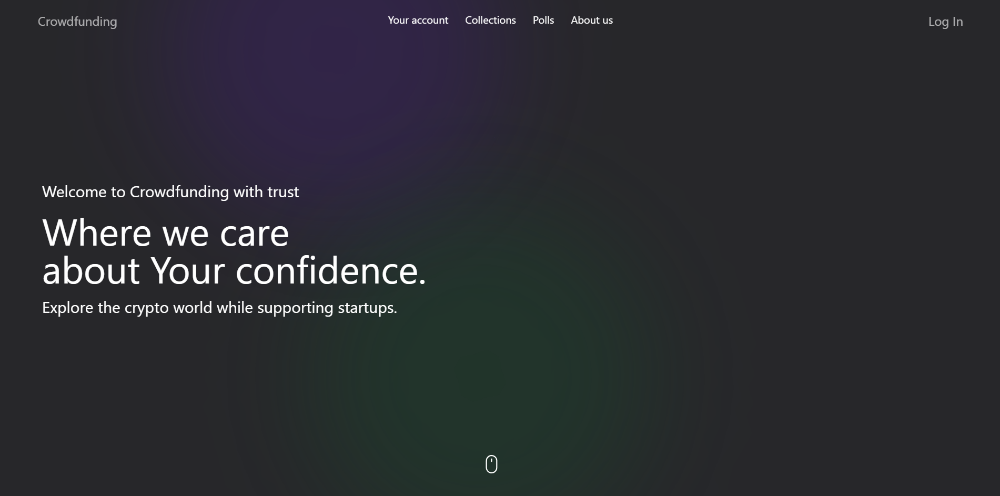
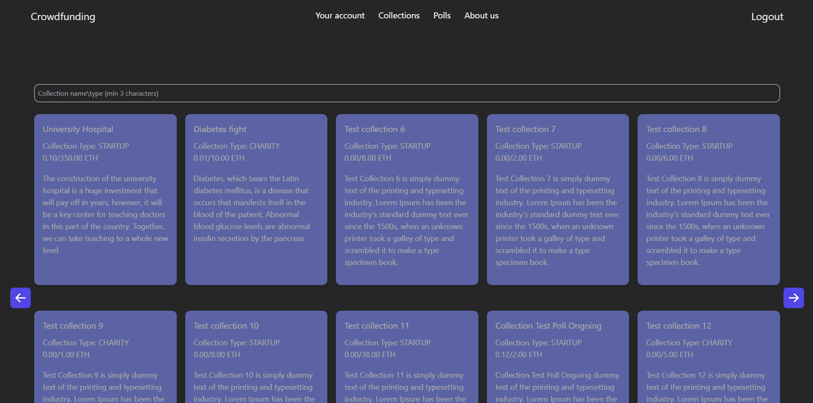
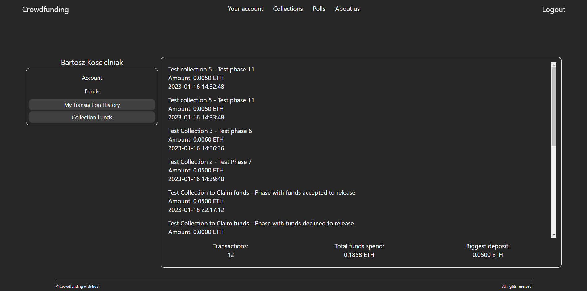

# Crowdfunding with trust WEB3

> WEB3 application based on blockchain, combined with Spring Boot and powered by React.js.  

## Table of contents
* [General info](#general-info)
* [Screenshots](#screenshots)
* [Setup](#setup)
* [Code Examples](#code-examples)
* [Tech/framework used](#techframework-used)
* [Status](#status)
* [Contact](#contact)
* [License](#license)

## General info
> Projects subject is associated with the system supporting both charity and start-ups collections. There is implementation of collections phase mechanism both with voting over work progress. These solutions aims to increase the attractiveness and functionality of website. The key task is to increase the security and introducing of financial transparency. To achieve this, application contains of deposit mechanism which secure funds until the end of collection. This solution has been implemented with blockchain and Smart Contracts. Contracts are agreement between the users, that cannot be broken down. These technologies works along with Spring Boot, which is base of website and also frontend JavaScript’s library – React.js.

## Screenshots

   

       
Main Page

    <ul>
      
    </ul>
   

	

       
Collections Page

    <ul>
      
    </ul>
   

	

       
Transaction History

    <ul>
      
    </ul>
   

## Setup

> Frontend: 
>* npm install
>* npm run dev

> Backend:
>* Adjust database specification in _application.properties_
>* Change Chain ID in _application.properties_
>* Change node URL in _application.properties_
>* Change address which deploy Smart Contracts in _application.properties_

## Code Examples
Logic of deposit mechanism both with function to release funds:

        function depositFunds(address _receiver, uint256 _amount, uint256 _phaseId) external payable{

        require(msg.sender != _receiver,                        "You cannot deposit funds to own collection");
        require(_amount > 0,                                    "Incorrect amount");
        require(fundsDonated[_phaseId].isFraud != true,         "Cannot deposit funds, phase status: fraud");
        require(fundsDonated[_phaseId].isPollEnded != true,     "Cannot deposit funds to ended phase");

        if(fundsDonated[_phaseId].receiver == address(0x0)) {
            fundsDonated[_phaseId].receiver     = _receiver;
            fundsDonated[_phaseId].amount       = _amount;
            fundsDonated[_phaseId].isFraud      = false;
            fundsDonated[_phaseId].isPollEnded  = false;
            fundsDonated[_phaseId].timestamp    = block.timestamp;
        } else {
            fundsDonated[_phaseId].amount       += _amount;
        }

        transactionHistory.push(TransactionStruct(
            msg.sender,
            address(this),
            _phaseId,
            _amount,
            block.timestamp
        )); 

        emit FundsEmition(
            msg.sender,
            address(this),
            _amount,
            _phaseId,
            block.timestamp
        );

        donationsCount++;
    }

    function sendFundsToOwner(address payable _toReceive, uint256 _phaseId) public {

        require(fundsDonated[_phaseId].receiver != address(0x0),    "Invalid phase ID");
        require(msg.sender == fundsDonated[_phaseId].receiver,      "Only the collection owner can withdraw funds");
        require(_toReceive == fundsDonated[_phaseId].receiver,      "Only the collection owner can withdraw funds");
        require(fundsDonated[_phaseId].amount > 0,                  "Insufficient funds");
        require(fundsDonated[_phaseId].isPollEnded == true,         "Poll has not end");
        require(fundsDonated[_phaseId].isFraud == false,            "Phase status is fraud. You cannot withdraw funds!");

        emit FundsEmition(
            address(this),
            fundsDonated[_phaseId].receiver,
            fundsDonated[_phaseId].amount,
            _phaseId,
            block.timestamp
        );

        transactionHistory.push(TransactionStruct(
            address(this),
            fundsDonated[_phaseId].receiver,
            _phaseId,
            fundsDonated[_phaseId].amount,
            block.timestamp
        ));

        _toReceive.transfer(fundsDonated[_phaseId].amount);
        fundsDonated[_phaseId].amount = 0;
    }

## Tech/framework used

* Spring Boot
* Web3j
* Mockito
* Solidity
* React.js
* Tailwind CSS

## Status
Project is in: _development_ phase :monocle_face:

## Contact
[@Bartosz Koscielniak](https://github.com/BartoszKoscielniak)

## License
[MIT](https://choosealicense.com/licenses/mit/)

